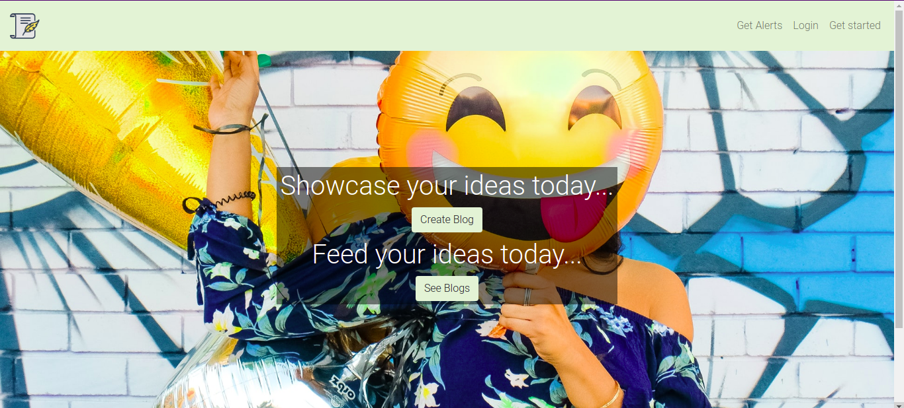

<h1 align="center"><u>BLOGSPOT</u></h1>

Welcome to blogspot! This is an online blogging platform that offers a variety of services for subscribed users as well as unsubscribed ones.

<h2>Contributors</h2>
1. Ken Mbira

<h2>Technologies Used</h2>
<ol>
<li>Python</li>
<li>HTML</li>
<li>Bootstrap</li>
<li>Javascript</li>
<li>Flask</li>
<li>Summernote</li>
<li>Figma design tool for the mockup <a href="https://www.figma.com/file/bFhJpVLk0XNb0L3DxZRSbr/BLOG-SPOT">design</a></li>
<li>Coolors for the color scheme generation</li>
<ol>

<h2>Setup Instructions</h2>

To have the app up and running in your own local machine, follow the following instructions:

<ol>
<li>Designate a directory to house the app.</li>
<li>Within that directory run <code>git clone https://github.com/Ken-mbira/PITCH_ARENA.git</code></li>
<li>Then navigate inside the directory PITCH_ARENA and create a virtual environment. To do so run <code>python3 -m venv virtual followed by source virtual/bin/activate</code> to activate the virtual environment.</li>
</ol>
<h3 align="center">Dependencies</h3>

To run the application locally, you have to make sure you have all dependencies specified in the requirements.txt file or just run: <code>pip install -r requirements.txt</code>

After this create a .env file in the root directory of the app and within it paste the following:
<ul>
<li><code>export FLASK_APP=manage.py</code></li>
<li><code>export FLASK_ENV=development</code></li>
<li><code>export SECRET_KEY=1234</code></li>
</ul>

<h3 align="center">Running the app</h3>

After all dependencies have been installed successfully on the terminal run <code>flask run</code>

<h2>App Description</h2>

The app offers multiple features like creating an account and subscribing to alerts after the creation of a new post. The app utilises a database to store the information passed on like the user credentials and blog information. As a bonus every user can enjoy the inspiration quotes in the landing page which change with every refresh.

The combination of all these technologies bring about the following user stories:
<ol>
<li>A user can view the posts on the site</li>
<li>A user can comment on a post</li>
<li>A user can view the posts in order from the latest</li>
<li>A user can join a subscription where they receive alerts after the creation of a new blog</li>
<li>A subscribed user can sign in in order to access some features</li>
<li>A uer can create a blog on the site</li>
<li>A user can delete comments on their blog</li>
<li>A user can delete or update a blog that they have created</li>
</ol>

<h2>Known bugs</h2>

Currently there are no known bugs

<h2>Future Improvements</h2>

I would like to implement an admin status where that specific user has special features than all others.

<h2>Contact Information</h2>

To contact me:
<ol>
<li>Phone: 0758926990</li>
<li>Github: Ken-mbira</li>
<li>Twitter: Ken Mbira</li>
<li>LinkedIn: Ken Mbira</li>
<li>email: mbiraken17@gmail.com</li>
</ol>

<h2>License Information</h2>

MIT License

Copyright (c) [2021] [Ken-Mbira]

Permission is hereby granted, free of charge, to any person obtaining a copy of this software and associated documentation files (the "Software"), to deal in the Software without restriction, including without limitation the rights to use, copy, modify, merge, publish, distribute, sublicense, and/or sell copies of the Software, and to permit persons to whom the Software is furnished to do so, subject to the following conditions:

The above copyright notice and this permission notice shall be included in all copies or substantial portions of the Software.

THE SOFTWARE IS PROVIDED "AS IS", WITHOUT WARRANTY OF ANY KIND, EXPRESS OR IMPLIED, INCLUDING BUT NOT LIMITED TO THE WARRANTIES OF MERCHANTABILITY, FITNESS FOR A PARTICULAR PURPOSE AND NONINFRINGEMENT. IN NO EVENT SHALL THE AUTHORS OR COPYRIGHT HOLDERS BE LIABLE FOR ANY CLAIM, DAMAGES OR OTHER LIABILITY, WHETHER IN AN ACTION OF CONTRACT, TORT OR OTHERWISE, ARISING FROM, OUT OF OR IN CONNECTION WITH THE SOFTWARE OR THE USE OR OTHER DEALINGS IN THE SOFTWARE.

